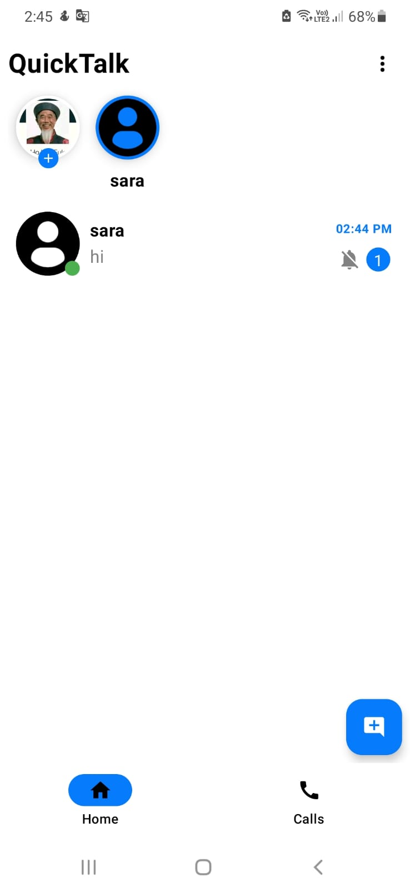
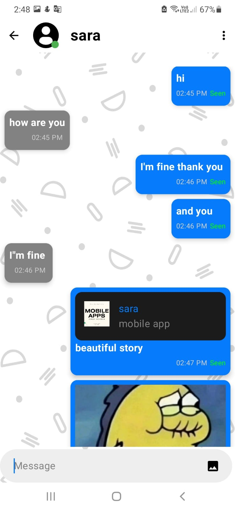
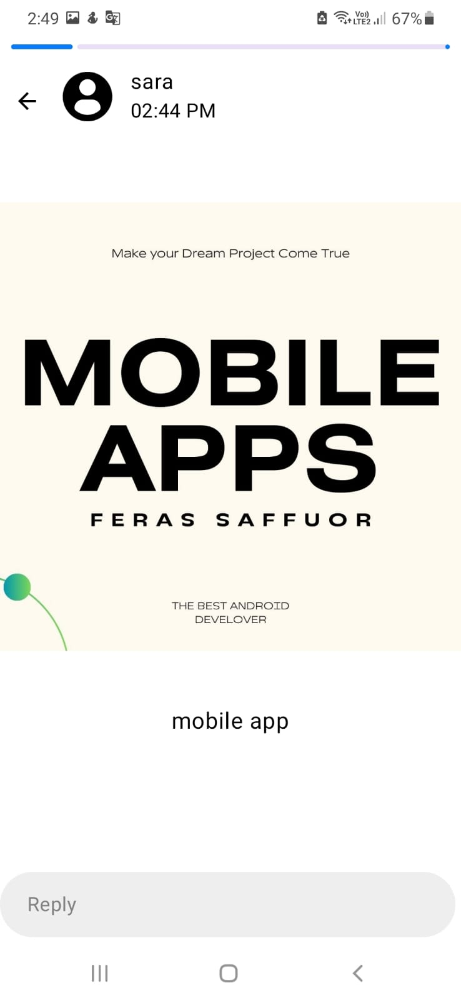
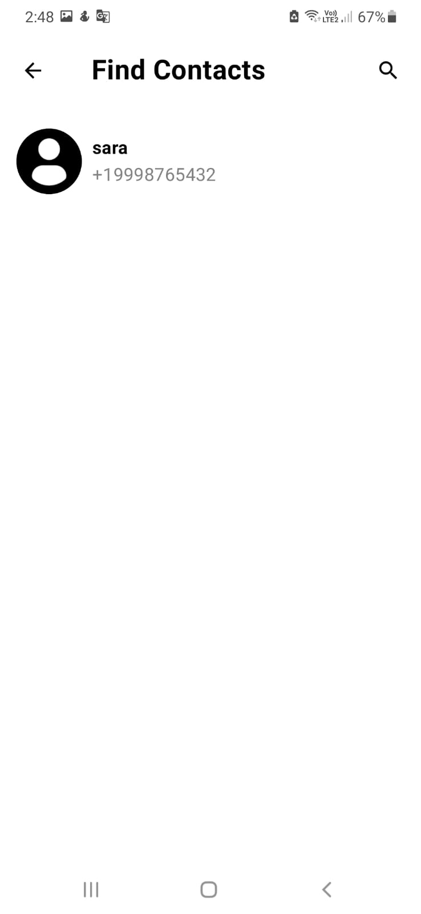
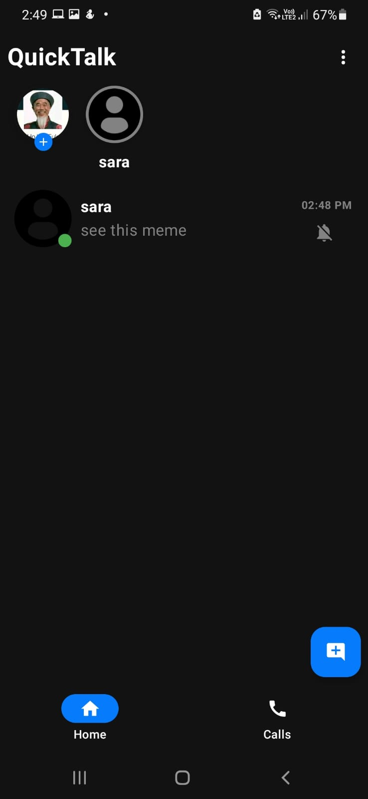

# QuickTalk – Chat Application (Jetpack Compose)

A WhatsApp-like chat application built with **Jetpack Compose** and **Firebase Realtime Database**.

## 🚀 Features
- Real-time chat
- Stories (Status)
- Send & receive friend requests
- Push notifications (OneSignal)
- Modern UI with Jetpack Compose
- MVVM Architecture

## 🛠 Tech Stack
- Kotlin
- Jetpack Compose
- Firebase Realtime Database
- Firebase Authentication (Phone Number)
- Cloudinary (for images)
- OneSignal (notifications)
- MVVM Architecture

## 📱 Screenshots

## ❗ Notes
- Calls and voice messages are not implemented yet.
- App uses demo users for testing purposes.
- user 1
  Number : +1 111-222-3333 OTP : 123456
- user 2
  Number : +1 999-876-5432 OTP : 654321

## 👨‍💻 Author
Firas Saffour
